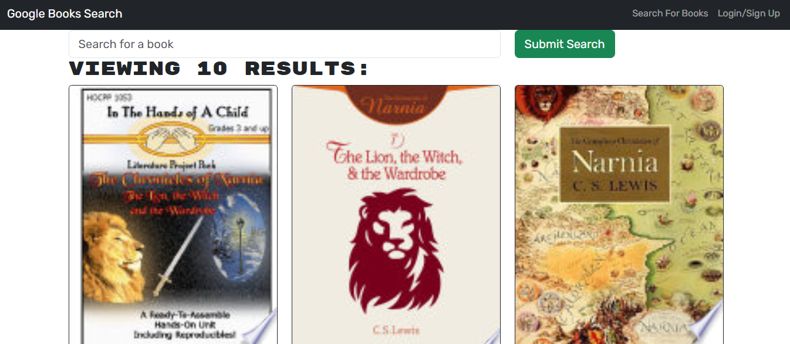
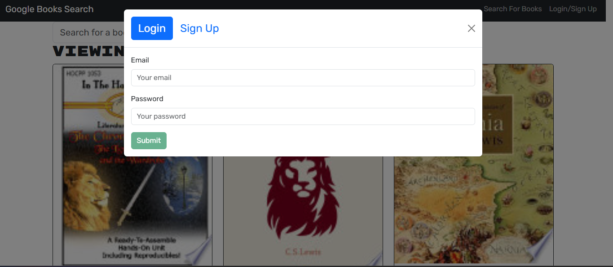

# BookSearch


## Description

BookSearch is a web application that allows users to search for books using the Google Books API and save their favorite books. The application is built with a React frontend and an Express backend, and it uses Apollo Client for GraphQL queries and mutations.

## Features

- Search for books using the Google Books API
- Save favorite books to a personal list
- Remove books from the saved list
- User authentication and authorization

# Installation

## 1. Clone the repository:
   ```sh
   git clone https://github.com/Dsien/BookSearch.git
   ```

Navigate to the project directory:
   ```sh
   cd BookSearch
   ```

Install dependencies for the client and server:
   ```sh
   npm install
   cd client && npm install
   cd ../server && npm install
   ```

Start the development server:
   ```sh
   npm run develop
   ```

## Images

Here are some screenshots of the BookSearch application:

### Home Page


### Login/Logout
